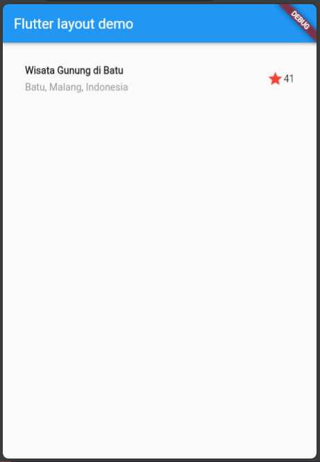
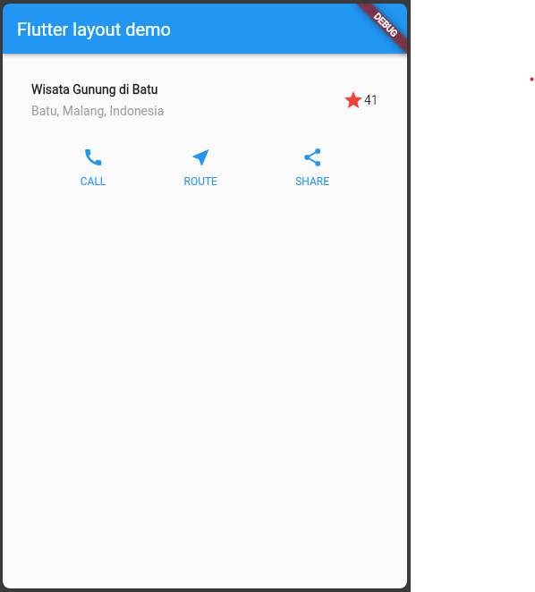
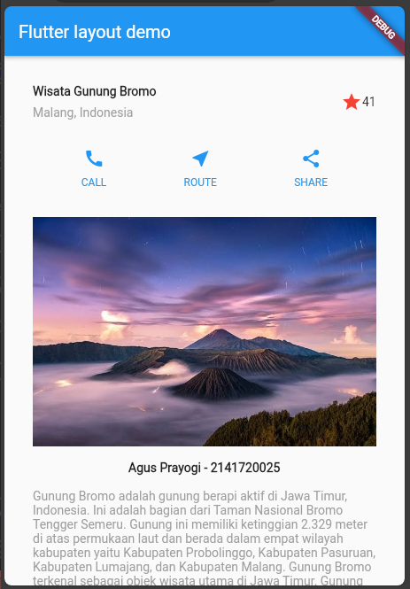

# Pertemuan 7

## Praktikum 1 : Membangun Layout di Flutter
* Code 

```dart
Container(
    padding: const EdgeInsets.all(32),
    child: Row(
        children: [
            Expanded(
                /* soal 1*/
                child: Column(
                    crossAxisAlignment: CrossAxisAlignment.start,
                    children: [
                        /* soal 2*/
                        Container(
                            padding: const EdgeInsets.only(bottom: 8),
                            child: const Text(
                                'Wisata Gunung di Batu',
                                style: TextStyle(
                                    fontWeight: FontWeight.bold,
                                ),
                            ),
                        ),
                        const Text(
                            'Batu, Malang, Indonesia',
                            style: TextStyle(color: Colors.grey),
                        ),
                    ],
                ),
            ),
            /* soal 3*/
            const Icon(
                Icons.star,
                color: Colors.red,
            ),
            const Text("41"),
        ],
    ),
);
```



