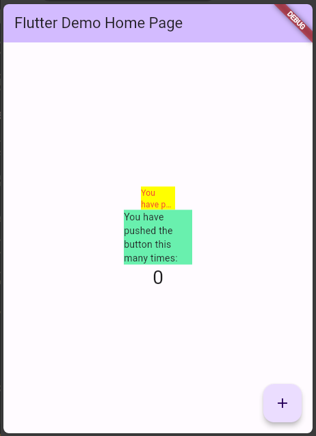

# Praktikum 9 - Plugin

## D4-TI-3A
## Agus Prayogi (2141720025 / 05)

## Penjelasan
- Menambahkan package `auto_size_text` dengan menggunakan perintah

```bash
flutter pub add auto_size_text
```
Pada langkah ini kita akan menambahkan package `auto_size_text` yang berguna untuk membuat text yang dapat menyesuaikan ukuran fontnya dengan ukuran container yang telah ditentukan.


- Membuat file baru bernama `red_text_widget.dart` di dalam folder lib lalu isi kode seperti berikut.

```dart
import 'package:auto_size_text/auto_size_text.dart';
import 'package:flutter/material.dart';

class RedTextWidget extends StatelessWidget {
  const RedTextWidget({
    Key? key,
    required this.text,
  }) : super(key: key);

  final String text;

  @override
  Widget build(BuildContext context) {
    return AutoSizeText(
      text,
      style: const TextStyle(color: Colors.red, fontSize: 14),
      maxLines: 2,
      overflow: TextOverflow.ellipsis,
    );
  }
}
```
Kode diatas digunakan untuk membuat widget baru yang berisi text dengan warna merah dan maksimal 2 baris.

- Pada langkah 5 diatas kita menggukan sebuah variable yang bernama `text` yang dapat diisi dengan text yang akan ditampilkan pada widget yang telah dibuat. 

- Menggunakan widget yang telah dibuat pada file `main.dart`, di dalam body dari scaffold seperti berikut.

```dart
Column(
  mainAxisAlignment: MainAxisAlignment.center,
  children: <Widget>[
    Container(
      color: Colors.yellowAccent,
      width: 50,
      child: const RedTextWidget(
        text: 'You have pushed the button this many times:',
      ),
    ),
    Container(
      color: Colors.greenAccent,
      width: 100,
      child: const Text(
        'You have pushed the button this many times:',
      ),
    ),
    Text(
      '$_counter',
      style: Theme.of(context).textTheme.headlineMedium,
    ),
  ],
),
```
- Pada langkah 6 ini, terdapat 2 widget text yang pertama menggunakan widget yang telah dibuat pada langkah 5 dan yang kedua menggunakan widget bawaan dari flutter. perbedaan dari kedua widget tersebut adalah pada widget yang pertama text yang ditampilkan akan menyesuaikan ukuran fontnya dengan ukuran container yang telah ditentukan dan terdapat batasan maksimal 2 line sedangkan pada widget yang kedua text yang ditampilkan tidak akan menyesuaikan ukuran fontnya dengan ukuran container yang telah ditentukan.

- Hasilnya seperti berikut.
- 