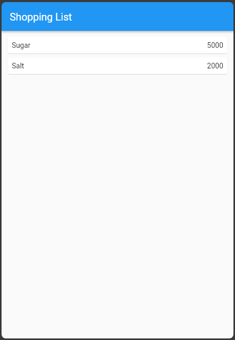
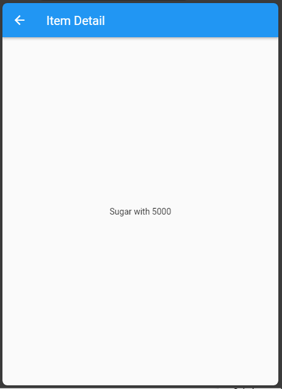
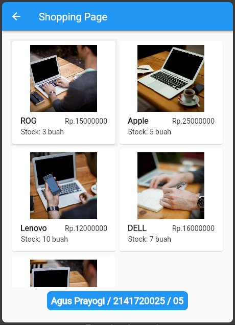
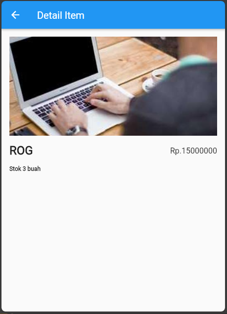

# UTS

## Tugas Praktikum 1
Penjelasan dan code program terdapat di dalam folder `basic_layout_flutter`.

Link : [basic_layout_flutter](./basic_layout_flutter)

## Praktikum 5: Membangun Navigasi di Flutter

1. Mendefinisikan Route => bukalah file main.dart. Pada langkah ini anda akan mendefinisikan Route untuk kedua halaman tersebut. Definisi penamaan route harus bersifat unique. Halaman `HomePage` didefinisikan sebagai `/`. Dan halaman `ItemPage` didefinisikan sebagai `/item`. Untuk mendefinisikan halaman awal, anda dapat menggunakan `named argument initialRoute`. Gambaran tahapan ini, dapat anda lihat pada potongan kode berikut.

```dart
MaterialApp(
  title: 'Navigasi Flutter',
  theme: ThemeData(
    colorScheme: ColorScheme.fromSeed(seedColor: Colors.blue),
    appBarTheme: const AppBarTheme(
      backgroundColor: Colors.blue,
      foregroundColor: Colors.white,
    ),
  ),
  debugShowCheckedModeBanner: false,
  initialRoute: '/',
  routes: {
    '/': (_) => HomePage(),
    '/item': (_) => const ItemPage(),
  },
)
```

2. Membuat data model => Sebelum melakukan perpindahan halaman dari `HomePage` ke `ItemPage`, dibutuhkan proses pemodelan data. Pada desain mockup, dibutuhkan dua informasi yaitu nama dan harga. Untuk menangani hal ini, buatlah sebuah file dengan nama `item_model.dart` dan letakkan pada folder models. Pada file ini didefinisikan pemodelan data yang dibutuhkan. Ilustrasi kode yang dibutuhkan, dapat anda lihat pada potongan kode berikut.

```dart
class ItemModel {
  String name;
  int price;

  ItemModel({required this.name, required this.price});
}
```
3. Pada halaman `HomePage` terdapat `ListView` widget. Sumber data `ListView` diambil dari model List dari object Item. Gambaran kode yang dibutuhkan untuk melakukan definisi model dapat anda lihat sebagai berikut. Item pada `ListView` saat ini ketika ditekan masih belum memberikan aksi tertentu. Untuk menambahkan aksi pada `ListView` dapat digunakan widget `InkWell` atau GestureDetector. Perbedaan utamanya `InkWell` merupakan material widget yang memberikan efek ketika ditekan. Sedangkan GestureDetector bersifat umum dan bisa juga digunakan untuk gesture lain selain sentuhan. Pada praktikum ini akan digunakan widget `InkWell`.

```dart
class HomePage extends StatelessWidget {
  HomePage({super.key});

  final list = [
    ItemModel(name: "Sugar", price: 5000),
    ItemModel(name: "Salt", price: 2000),
  ];

  @override
  Widget build(BuildContext context) {
    return Scaffold(
      appBar: AppBar(
        title: const Text("Shopping List"),
      ),
      body: Container(
        margin: const EdgeInsets.all(8),
        child: ListView.builder(
          itemCount: list.length,
          itemBuilder: (context, index) {
            var item = list[index];
            return InkWell(
              onTap: () {
                Navigator.pushNamed(context, '/item', arguments: item);
              },
              child: Card(
                child: Container(
                  margin: const EdgeInsets.all(8),
                  child: Row(
                    children: [
                      Expanded(child: Text(item.name)),
                      Expanded(
                        child: Text(
                          item.price.toString(),
                          textAlign: TextAlign.end,
                        ),
                      ),
                    ],
                  ),
                ),
              ),
            );
          },
        ),
      ),
    );
  }
}
```
4. Membuat item_page.dart untuk tujuan detail saat melakukan klik ke salah satu item

```dart
class ItemPage extends StatelessWidget {
  const ItemPage({super.key});

  @override
  Widget build(BuildContext context) {
    final item = ModalRoute.of(context)!.settings.arguments as ItemModel;
    return Scaffold(
      appBar: AppBar(
        title: const Text("Item Detail"),
      ),
      body: Center(
        child: Text("${item.name} with ${item.price}"),
      ),
    );
  }
}

```

- Hasil Output Program
- 
- Saat di klik salah satu item maka akan menampilkan detail item
- 

## Tugas Praktikum 2

1. Membuat file `shopping_page.dart` untuk menampilkan detail item

```dart
class ShoppingModel {
  String image;
  String name;
  int price;
  int stock;

  ShoppingModel({
    required this.image,
    required this.name,
    required this.price,
    required this.stock,
  });
}
```

2. Membuat file `shopping_page.dart` untuk menampilkan list item

```dart

class ShoppingPage extends StatelessWidget {
  ShoppingPage({super.key});

  final list = [
    ShoppingModel(
      image: 'https://picsum.photos/500?image=1',
      name: "ROG",
      price: 15000000,
      stock: 3,
    ),
    ShoppingModel(
      image: 'https://picsum.photos/500?image=2',
      name: "Apple",
      price: 25000000,
      stock: 5,
    ),
    ShoppingModel(
      image: 'https://picsum.photos/500?image=3',
      name: "Lenovo",
      price: 12000000,
      stock: 10,
    ),
    ShoppingModel(
      image: 'https://picsum.photos/500?image=4',
      name: "DELL",
      price: 16000000,
      stock: 7,
    ),
    ShoppingModel(
      image: 'https://picsum.photos/500?image=5',
      name: "HP",
      price: 13000000,
      stock: 12,
    ),
  ];

  @override
  Widget build(BuildContext context) {
    return Scaffold(
      appBar: AppBar(
        title: const Text('Shopping Page'),
      ),
      body: Container(
        margin: const EdgeInsets.all(16),
        child: Column(
          children: [
            Expanded(
              child: GridView.builder(
                gridDelegate: const SliverGridDelegateWithFixedCrossAxisCount(
                  crossAxisCount: 2,
                ),
                itemCount: list.length,
                itemBuilder: (context, index) {
                  var item = list[index];
                  return InkWell(
                    onTap: () {
                      Navigator.pushNamed(context, '/detail', arguments: item);
                    },
                    child: Card(
                      child: Container(
                        margin: const EdgeInsets.all(8),
                        child: Column(
                          children: [
                            Expanded(
                              child: Hero(
                                tag: item.image,
                                child: Image.network(
                                  item.image,
                                  fit: BoxFit.cover,
                                ),
                              ),
                            ),
                            Padding(
                              padding: const EdgeInsets.all(8),
                              child: Column(
                                crossAxisAlignment: CrossAxisAlignment.start,
                                children: [
                                  Row(
                                    children: [
                                      Expanded(
                                          child: Text(
                                        item.name,
                                        style: const TextStyle(
                                          fontSize: 16,
                                          fontWeight: FontWeight.bold,
                                        ),
                                      )),
                                      Expanded(
                                        child: Text(
                                          "Rp.${item.price}",
                                          textAlign: TextAlign.end,
                                        ),
                                      ),
                                    ],
                                  ),
                                  const SizedBox(
                                    height: 4,
                                  ),
                                  Text(
                                    'Stock: ${item.stock} buah',
                                    textAlign: TextAlign.end,
                                  ),
                                ],
                              ),
                            ),
                          ],
                        ),
                      ),
                    ),
                  );
                },
              ),
            ),
            Container(
              margin: const EdgeInsets.all(8),
              padding: const EdgeInsets.all(8),
              decoration: BoxDecoration(
                color: Colors.blue,
                borderRadius: BorderRadius.circular(8),
              ),
              child: const Text(
                'Agus Prayogi / 2141720025 / 05',
                style: TextStyle(
                  color: Colors.white,
                  fontSize: 18,
                  fontWeight: FontWeight.bold,
                ),
              ),
            ),
          ],
        ),
      ),
    );
  }
}
```

3. Membuat file `detail_page.dart` untuk menampilkan detail item

```dart
class DetailPage extends StatelessWidget {
  const DetailPage({super.key});

  @override
  Widget build(BuildContext context) {
    final item = ModalRoute.of(context)!.settings.arguments as ShoppingModel;
    return Scaffold(
      appBar: AppBar(
        title: const Text('Detail Item'),
      ),
      body: Container(
        margin: const EdgeInsets.all(16),
        child: Column(
          crossAxisAlignment: CrossAxisAlignment.start,
          children: [
            Hero(
              tag: item.name,
              child: Image.network(
                item.image,
                height: 200,
                width: MediaQuery.of(context).size.width,
                fit: BoxFit.fitWidth,
              ),
            ),
            const SizedBox(height: 16),
            Row(
              children: [
                Text(
                  item.name,
                  style: const TextStyle(
                    fontSize: 24,
                    fontWeight: FontWeight.bold,
                  ),
                ),
                const Spacer(),
                Text(
                  "Rp.${item.price}",
                  style: const TextStyle(
                    fontSize: 16,
                  ),
                ),
              ],
            ),
            const SizedBox(height: 16),
            Text(
              "Stok ${item.stock} buah",
              style: const TextStyle(
                fontSize: 12,
                fontWeight: FontWeight.bold,
              ),
            ),
          ],
        ),
      ),
    );
  }
}
```

- Hasil Output Program
- 
- Saat di klik salah satu item maka akan menampilkan detail item
- 