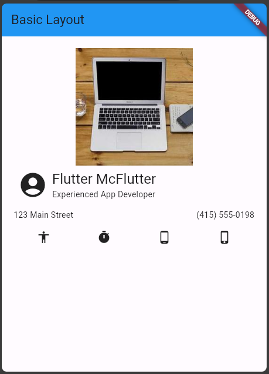

# basic_layout_flutter

Flutter adalah framework yang kuat untuk membangun aplikasi mobile dengan tampilan menarik. Untuk membuat tampilan yang baik dalam Flutter, Anda perlu memahami beberapa konsep dasar layout. Di bawah ini, saya akan sebutkan beberapa layout dasar dalam Flutter dan memberikan contoh kode untuk masing-masing.

 1. Container Layout: Container adalah widget dasar yang digunakan untuk mengatur tata letak dan dekorasi elemen-elemen lain dalam Flutter.
```dart
Container(
  width: 200,
  height: 100,
  color: Colors.blue,
  child: Center(
    child: Text("Hello, Flutter!"),
  ),
)
  ```
2. Row Layout: Row adalah widget yang digunakan untuk mengatur tata letak elemen-elemen dalam satu baris.
```dart
Row(
  mainAxisAlignment: MainAxisAlignment.spaceAround,
  children: [
    Icon(Icons.accessibility),
    Icon(Icons.timer),
    Icon(Icons.phone_android),
    Icon(Icons.phone_iphone),
  ],
)
```
3. Column Layout: Column adalah widget yang digunakan untuk mengatur tata letak elemen-elemen dalam satu kolom.
```dart
Column(
  crossAxisAlignment: CrossAxisAlignment.start,
  mainAxisSize: MainAxisSize.min,
  children: [
    Text(
      'Flutter McFlutter',
      style: Theme.of(context).textTheme.headlineSmall,
    ),
    const Text('Experienced App Developer'),
  ],
),
```
4. Stack Layout: Stack adalah widget yang digunakan untuk mengatur tata letak elemen-elemen dengan cara menumpuknya.
```dart
Stack(
  children: <Widget>[
    Container(
      width: 200,
      height: 200,
      color: Colors.red,
    ),
    Container(
      width: 150,
      height: 150,
      color: Colors.green,
    ),
    Container(
      width: 100,
      height: 100,
      color: Colors.blue,
    ),
  ],
)
```
5. Image Widget: Image adalah widget yang digunakan untuk menampilkan gambar.
```dart
Image.network(
  "https://picsum.photos/250?image=9",
  width: 200,
  height: 200,
)
```

- Hasil Akhir Tampilan Aplikasi
- 